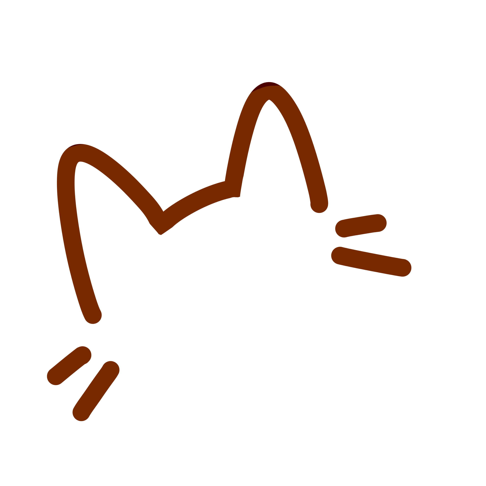
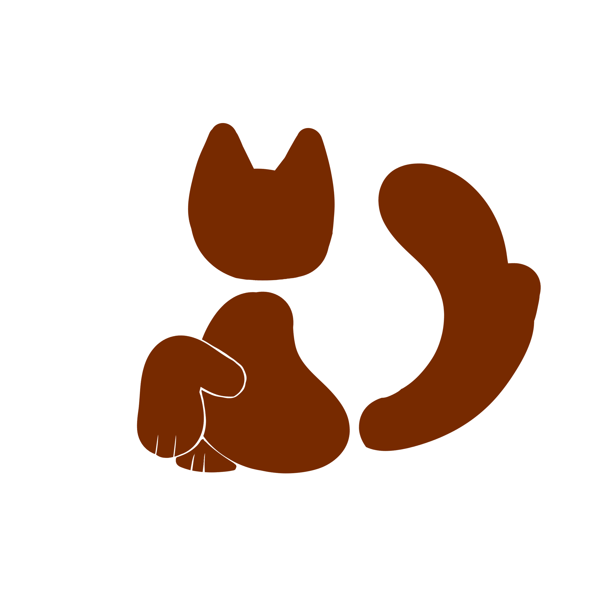
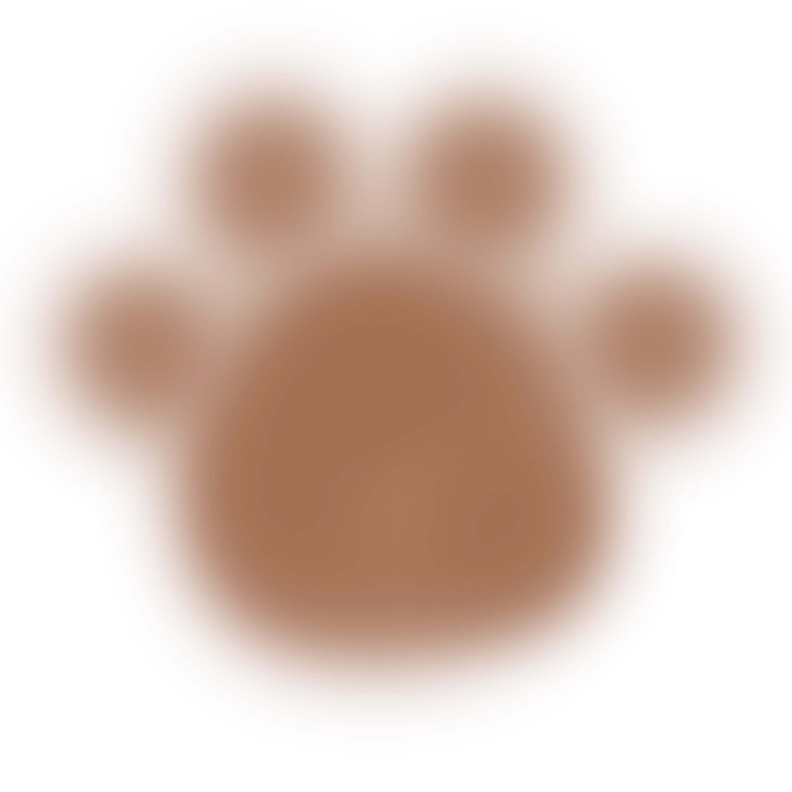

///*

 #photogalleryclick .photoclickgallery
    {
        position:absolute;
        top: 280px;
        margin-left: -57%;
        width: 860px;
        z-index: 1;}

{
        display: none;
        text-align: center;
        width: 100%;
}

############################# REDOING
>>>>>>>>>>> CSS
.photoclickgallery
    {
        position:absolute;
        top: 280px;
        margin-left: -57%;
        width: 860px;
    }

    #photodecoration
    #photodecoration.photoclickgallery
    {
    
        position:absolute;
        top: 280px;
        margin-left: -57%;
        width: 860px;
    
    }

    #photodecoration .photoclickgallery
    {
        transition: all 0.3s ease;
        cursor: pointer;
    }

    #photodecoration .photodecoration:hover {
        transform: scale(1.1);
        filter: brightness(0px 0px 15px rgba (161, 98, 16, 0.5));
    }
    
#photogalleryclicked

#photogalleryclicked {
        display: none;
        text-align: center;
        width: 100%;
}

 
    
    .photogallerytitle
    { 
        font-family: Georgia, monospace; 
        font-size: 170px;
        margin: 0;
        position:relative;
        top: 20px;
        text-align: center;
        background: linear-gradient(to bottom, #772A00 20%, #a16210 80%) !important;
        -webkit-background-clip: text !important;
        background-clip: text !important;
        -webkit-text-fill-color: transparent !important;

    }

>>>>>>>>>>>> HTML
 HOME<<<<< 

         

    

 
    
  
        <h2>Welcome to my cat gallery</h2>
    

  

>>>>>>>>>>>>>> JS

const gallerybutton = document.getElementById('photodecoration');
        const home = document.getElementById('home1');
        const gallerytitle = document.getElementById('gallerytitle');

        gallerybutton.addEventListener('click', () => {
            home.style.display = 'none'
            gallerytitle.style.display = 'flex'
        });

############################################################

    

   

    
    

        
     <h1 class="gradienttitletext"> Catnip </h1>
     
 
   

   

    
     
    

    

    
  

    

   <h1> PUSSLE </h1>
    
 

###########################################################
 
<button onclick="changepage">go to page 2</button>
    <button onclick="alternaction()">
        <h1> button</h1>
    </button> 

###########################################################
function back() {

    document.getElementById('game1').style.display = 'none'
    document.getElementById('homepage').style.display = 'block'

     game1button.addEventListener('click', () => {
            game1.style.display = 'none';
            homepage.style.display = 'flex'
        });
}       

###########################################################

 id="galleryaction"  class="galleryphoto"

    
        

############################################################

 #game1 h1 {
        font-family: Georgia, monospace; 
        font-size: 250px;
        margin: auto;

#############################################################

 

##############################################################
 margin-top: 6%;
        margin-left: 20%;
############################ 
s#puzzle-board {
                border: 2px solid #b66904; 
                background-color: #5a3210; 
                padding: 0%;
                width: 600px;
                height: 600px;
                display: grid;
                margin-left: 33%;
                position: absolute;
                top: 600px;
               
             }
##################################

 #game1 .welcometext {
        position: relative;
        font-family: cursive; 
        font-size: 50px;
        
        
        margin-left: 40% auto;
        margin-right: 28% auto;

        margin: auto;
        margin-top: 500px;
        
        align-items: center;
        text-align: center;
        color: #772A00;
    }

######################################
margin-left: auto;
        margin-right: auto;
#####################################
padding-inline: 50%;
margin-inline: 50%;

left: 25%;
        right: 25%;
        margin-right: 25%;
        margin-left: 25%;
#######################################
 
<h3> welcome to my cars game:3</h3>

#######################################

var rows = 3;
var columns 3;

var currTile;
var otherTile;

##########################################

botón de regreso en la pagina de pussle

<button onclick="back()" class="buttononclickback">back</button>

##########################################

h3 {
        position: absolute;

        left: 50%;
        transform: translateX(-50%);

        width: 404px;
        margin-top: 500px;
        
        
        font-family: cursive; 
        font-size: 30px;
        color: #772A00;
        text-align: center;

    }

################################################

    .play {
        position: relative;
        height: 50%;
        margin-top: 180px;
        margin-left: 15%;
        width: 300px;

################################################

    .photog {
        position: absolute;
        top: -160px;
        left: -5%;
        height: 20p0x;

    }
    .photog {
        transition: all 0.3s ease;
        cursor: pointer;
    }
    .photog :hover {
       transform: scale(1.1);
       filter: brightness(0px 0px 15px rgba (161, 98, 16, 0.5));
    }

<<<<<<<<<<<<<<<<<<<<<<<<<<<<< SOLVE
H1 CSS RELATED TO ALL H1
PUSSLE & GALLERY CURSOR FOLLOWER
MAKE AN EFFECT FOR ALL IMAGES IN GALLERY, ADD MORE IMAGES
SOLVE THE HOMEPAGE CSS

###############################################

left: 50%;
       transform: translateX(-50%);
    /*HOME PAGE BODY*/

.title-box
    {
       position: relative;
       width: 200px;
       max-width: 1200px;
       
       height: 200px;

##################################################

=> {

      }
      {
        cursor.style.left = `$ 
        {e.clientX}px`;
              cursor.style.top = `$ 
              {e.clientY}px`;});

#######

transition: all 0.3s ease;
        cursor: pointer;

########

<h3>Goku</h3>

h1:hover{
        transform: scale(1.1,1.1);
        
    }
############################## js
const button = document.querySelectorAll('button');

   button.forEach(button => {
    button.addEventListener('mouseenter', () =>
    {
      cursor.classList.add('active');
    });
    button.addEventListener('mouseleave', () =>
    {
      cursor.classList.remove('active');
    });
    
  });

##############################################
function back() {

       document.getElementById('game1').style.display = 'none'
       document.getElementById('homepage').style.display = 'block'

       game1button.addEventListener('click', () => {
              game1.style.display = 'none';
              homepage.style.display = 'block'
        });

        const game1button = document.getElementById ('buttonchangepage1');
        const homepage = document.getElementById('homepage')
        const game1 = document.getElementById('game1')
            const rows = 3;
            const columns = 3;
            const board = document.getElementById('puzzle-board');

        game1button.addEventListener('click', () => {
            homepage.style.display = 'none'
            game1.style.display = 'flex';

            if (board) {
            board.style.gridTemplateColumns = `repeat(${columns}, 1fr)`;
            board.style.gridTemplateRows = `repeat(${rows}, 1fr)`;
    }s
        });
}    
#######################
            const rows = 3;
            const columns = 3;
            const board = document.getElementById('puzzle-board');
            if (board) {
            board.style.gridTemplateColumns = `repeat(${columns}, 1fr)`;
            board.style.gridTemplateRows = `repeat(${rows}, 1fr)`;
###########################
.backbuttonimg {
        cursor:url('pointer2.png') 4 4, pointer;
        }
        ########################

        .B-B-2:hover {
    transform: scale(1.1);
    transition: 0;
    filter: brightness(135%);
    transition: 0.2s;

     cursor:url('pointer2.png') 4 4, default;}

     ######################
  let draggedPiece = null;

pieces.forEach(piece => {

  piece.draggable = true;

  piece.addEventListener("dragstart", () => {
    draggedPiece = piece;
  });

  piece.addEventListener("dragover", (e) => {
    e.preventDefault();
  });

  piece.addEventListener("drop", () => {

    if (draggedPiece === piece) return;

    const tempBg = piece.style.backgroundPosition;
    piece.style.backgroundPosition =
      draggedPiece.style.backgroundPosition;

    draggedPiece.style.backgroundPosition = tempBg;
  });

});
########################   

id= "out-container-byID"

#############################################

THIS IS AN AI GENERATED CODE, I'M NOT USING AI IN MY CODE, BUT JS IS VERY HARD TO UNDERSTAND AND I'M ASKING AI TUTORIALS

  for (let y = 0; y < size; y++) {
  for (let x = 0; x < size; x++) {

    const piece = document.createElement("div");

    piece.classList.add("piece");

    piece.dataset.correctX = x;
    piece.dataset.correctY = y;

     piece.style.backgroundPosition =
      `-${x * 200}px -${y * 200}px`;

    pieces.push(piece);
  }
}
pieces.sort(() => Math.random() - 0.5);

// Agregar al tablero
pieces.forEach(piece => {
  board.appendChild(piece);
});

// Drag & Drop
let draggedPiece = null;

pieces.forEach(piece => {

  piece.draggable = true;

  piece.addEventListener("dragstart", () => {
    draggedPiece = piece;
  });

  piece.addEventListener("dragover", (e) => {
    e.preventDefault();
  });

  piece.addEventListener("drop", () => {

    if (draggedPiece === piece) return;

    const tempBg = piece.style.backgroundPosition;
    piece.style.backgroundPosition =
      draggedPiece.style.backgroundPosition;

    draggedPiece.style.backgroundPosition = tempBg;
  });

});

    *///